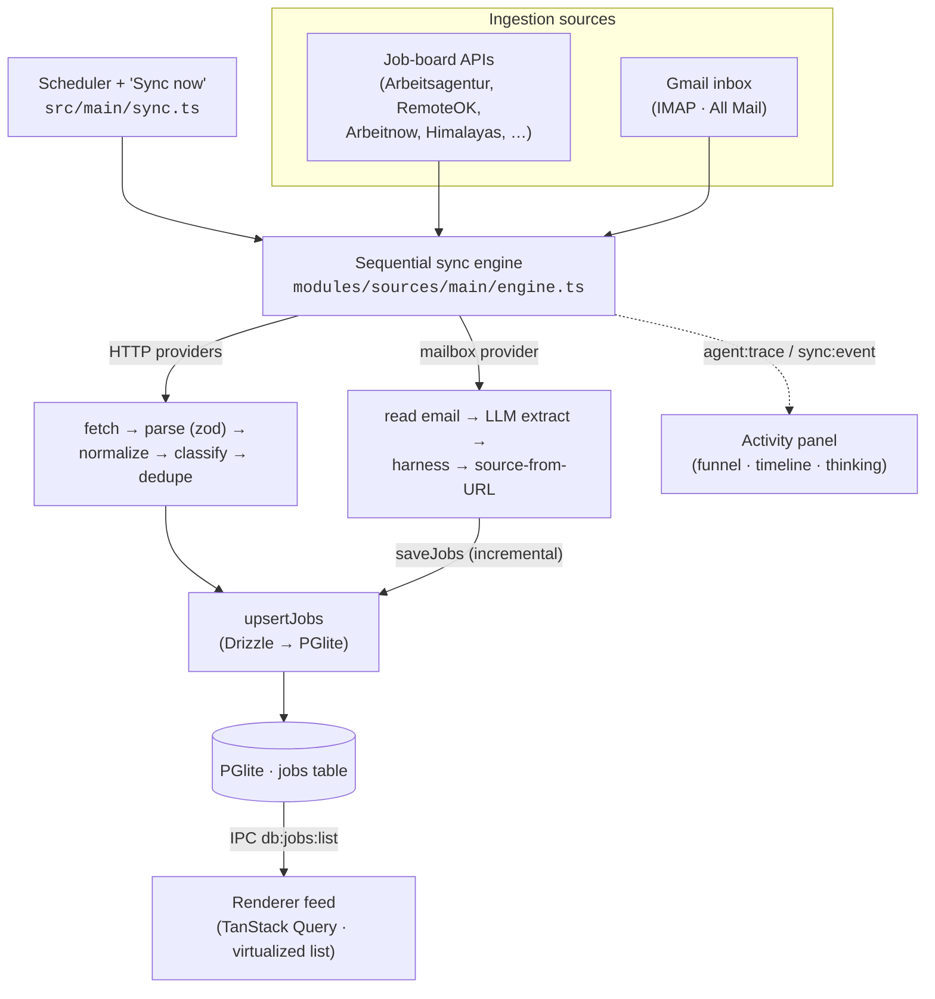
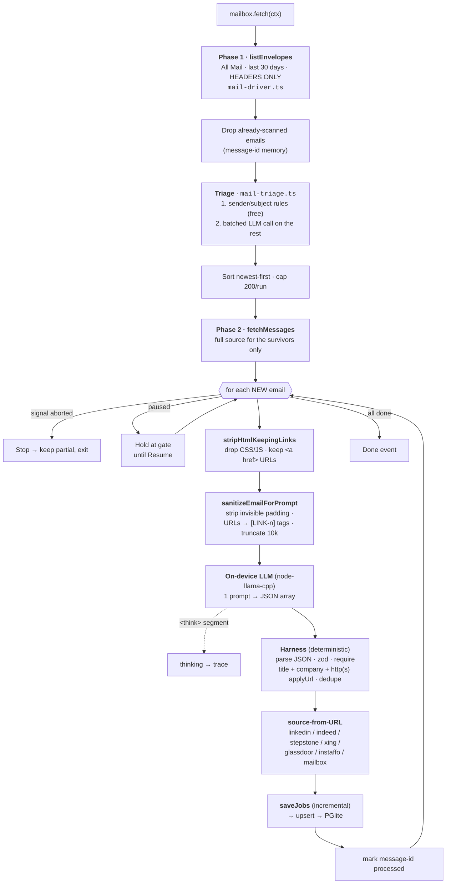
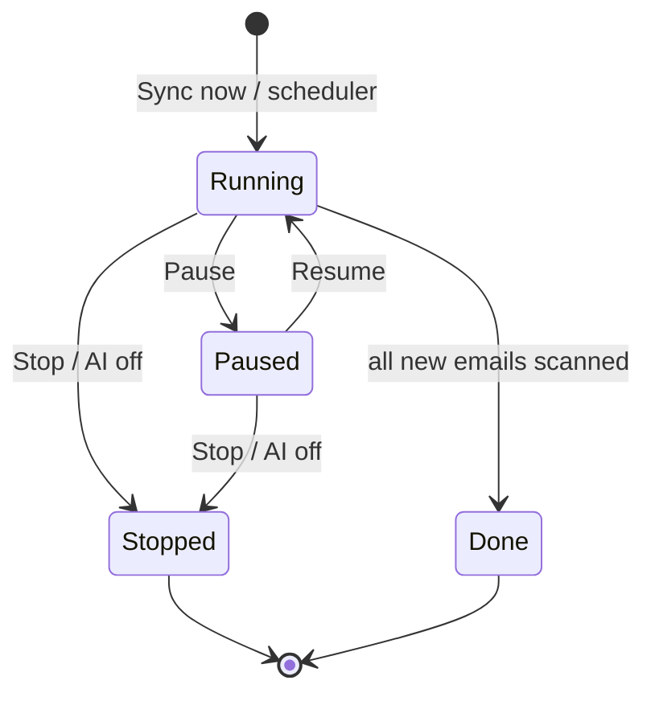

# AI architecture — how a posting becomes a feed job

EasyApply pulls jobs from **two kinds of source** and merges them into one
deduplicated feed:

1. **Job-board APIs** — Arbeitsagentur, RemoteOK, Arbeitnow, Himalayas,
   WeWorkRemotely, … — structured JSON/RSS, parsed deterministically.
2. **Your inbox** — a local LLM reads your Gmail and extracts postings from
   job-alert emails (the "agent").

Both routes run inside the Electron **main process** behind the same sequential
sync engine, normalize into the same `NormalizedJob` shape, and land in the same
PGlite table. The renderer is a pure read/act client over typed IPC. This
document maps the whole flow — with special focus on the on-device AI path — to
the code.

> Read `docs/ARCHITECTURE.md` first for the process split and the provider
> plugin contract. This doc goes deeper on the AI/agent path.

---

## The big picture



**One-way flow.** Job boards don't send CORS headers and some 403 non-browser
agents, so nothing fetches from the renderer — all network, parsing, LLM
inference, and storage live in main; the renderer only reads over IPC.

---

## The sync engine (both routes)

`runSync` (`modules/sources/main/engine.ts`) is **sequential and polite** — one
provider at a time, in registry order, never in parallel. `src/main/sync.ts` is
the Electron glue: the scheduler (30-min tick), the single-flight guard, the
`sync:*` / `agent:*` IPC, and the renderer push events.

Per provider, each pass:

1. **Gate** — skip if disabled, filtered out, or still inside its politeness
   window (a manual "Sync now" forces past the window).
2. **`fetch(ctx)`** — the async part (HTTP or IMAP+LLM). `ctx` carries the polite
   HTTP client, decrypted keys, the LLM, the abort/pause seams, and a
   `saveJobs` callback for incremental persistence.
3. **`parse(payload)`** — synchronous: raw → `NormalizedJob[]`.
4. **Dedupe by id**, then **`upsertJobs`** into PGlite.

One provider failing never sinks the pass; a failed attempt still advances its
politeness window so a broken API isn't hammered every tick.

---

## Route A — the API providers (deterministic)

The keyless/keyed job-board providers (`modules/sources/main/providers/*.ts`)
each implement `meta + fetch + parse`. Data flows through fixed stages:

```
raw JSON/RSS  →  zod validate  →  normalize  →  classify  →  dedupe  →  upsert
              (boundary parse)   (money, dates,  (work mode,  (by id)   (PGlite)
                                 entities)       remote scope)
```

No AI here — it's pure, testable transformation. `zod` schemas stay
module-internal; a throw becomes a `sync_run` error, never a crash.

---

## Route B — the email agent (the AI core)

The mailbox provider (`modules/sources/main/providers/mailbox.ts`) is one more
entry in the sequential loop, but its `fetch()` does IMAP + on-device LLM
extraction instead of an HTTP GET. This is the "agent."



### Stage by stage

1. **Read All Mail, in two phases** (`src/main/mail-driver.ts`). We resolve
   Gmail's `\All` special-use folder (locale-safe) rather than only `INBOX`, so
   alerts filtered into a label aren't missed. `imapflow` + `mailparser`; a
   stray socket error is caught (an unhandled one would crash main).
   - **Phase 1 — `listEnvelopes`**: headers only for the 30-day window. No
     bodies, no attachments, no inline images.
   - **Phase 2 — `fetchMessages`**: full source for an explicit UID set, after
     the caller has decided what is worth downloading. An empty set opens no
     connection at all.
   > Downloading everything and discarding the already-scanned afterwards cost
   > ~100 s and tens of MB *per sync* on a 313-message window — even when
   > nothing was new. Filtering on headers makes a fully-scanned window cost
   > headers alone.
2. **Skip already-scanned** — each message's `Message-ID` is remembered
   (persisted, capped at 5,000). The filter runs on the **envelopes**, between
   the two phases, so only genuinely new mail is ever downloaded. Newest first,
   capped at 200 per run (surfaced as `capped`, never a silent drop).
3. **Triage** (`modules/sources/main/mail-triage.ts`). Extraction costs a full
   LLM generation per email, and that cost is flat whether the email holds 25
   jobs or none — the model still reasons its way to "no jobs". Triage decides
   from headers alone which emails deserve it, driven by a **user-editable
   config** (`modules/sources/shared/mail-scan.ts`, managed on the Sources page,
   persisted in electron-store):
   - **Hard exclusion first**: a sender on a domain the user turned **off** is
     dropped before anything — never downloaded, triaged, or extracted, so no
     new jobs come from it (already-found jobs stay). `isExcludedSender`.
   - **Deterministic include**: an enabled job-sender domain (`linkedin.`,
     `instaffo.`, …) or a subject keyword the user configured. Free, instant.
   - **Then the model**, one batched call per chunk of 40, over only what the
     first two stages could not decide. It answers with row numbers, not text.
   > **Sender may include, never exclude.** An unrecognized sender is not
   > dropped — it goes to the model. And every failure path (unreadable answer,
   > failed call, aborted run, no model at all) **keeps** the mail. A filter that
   > can lose a job must fail open.
   >
   > Emails triaged out *are* marked processed, so the same newsletters aren't
   > re-judged every sync — the trade being that a mis-skipped email is not
   > reconsidered, which is why triage errs toward keeping.
4. **HTML → text, keeping links** (`stripHtmlKeepingLinks` in
   `modules/sources/main/normalize.ts`). Two things matter here:
   - **Drop `<style>`/`<script>` content** — marketing emails ship huge inline
     CSS that would otherwise fill the truncation window with gibberish.
   - **Keep `<a href>` targets as `text (url)`** — the apply link lives in the
     href, not the visible "View" text. Without this the model has no URL to
     extract and the harness drops every job.
5. **Prompt sanitization** (`modules/sources/main/mail-sanitize.ts`). Marketing
   mail pads its preview with hundreds of invisible characters and wraps every
   link in a ~1,500-char tracking URL — noise that tokenizes at ~1 token per
   2–3 chars and once had the model hand-copying a tracking URL for minutes.
   Invisible padding is stripped, and each URL becomes a short `[LINK-n]` tag
   the model cites instead of reproducing; the harness expands the tag back to
   the real URL after extraction. Sanitization runs *before* the 10k-char
   truncation, so the window holds listings, not URL noise.
6. **The LLM call** (`modules/sources/main/mail-extract.ts` →
   `src/main/llm.ts`). One single-shot prompt asks for a JSON array of
   `{title, company, location, workMode, applyUrl}`. No tools, no agent loop,
   no RAG — a structured-extraction prompt. Runs fully on-device.
7. **The reliability harness** — the trust comes from here, not the model:
   - lenient JSON extraction (grabs the first `[…]`, tolerates prose/fences);
   - `zod` validation, everything optional so one bad row can't sink the batch;
   - **anchor on a real link**: a job is kept only with a non-empty title,
     company, and an `applyUrl` citing a `[LINK-n]` tag that exists in the
     email (a raw `http(s)://` URL is still accepted) — a hallucinated posting
     with no genuine link never reaches the feed;
   - dedupe by slugified apply URL.
   > **The model proposes; the code disposes.** The funnel's "Jobs found" vs
   > "Kept" is exactly this gap.
8. **Source attribution** — the board is inferred from the **apply URL** host
   (`sourceFromUrl`), so any sender works; unknown hosts become the generic
   `mailbox` source.
9. **Incremental save** — each email's kept jobs are upserted via `ctx.saveJobs`
   *before* the email is marked processed, so a crash never loses work and never
   skips an email whose jobs weren't saved.

---

## The on-device model

`ModelManager` (`src/main/model.ts`) owns the model lifecycle; `src/main/llm.ts`
is the `node-llama-cpp` adapter behind the `LlmClient` seam
(`complete(prompt, { signal })`).

- **Catalog + switching** — Llama 3.1 8B Instruct (fast, default) and
  DeepSeek-R1 Distill 14B (reasoning). Each downloads once with a progress bar;
  switching unloads the old one. The selected id persists.
- **Memory cap** — the context (KV cache) is bounded (`contextSize: 4096`) and
  weights are `mmap`'d, so runtime memory stays ~6 GB for the 8B instead of
  auto-grabbing all RAM. The **AI on/off** toggle unloads the model entirely.
- **Thinking** — reasoning models emit a `thought` segment; the adapter collects
  it (`onResponseChunk`) and re-wraps it as `<think>…</think>` so
  `splitThinking` can surface it to the timeline while the extractor still gets
  clean JSON.

The extraction logic is unit-tested against a **fake `LlmClient`** — no model
needed in CI.

---

## Agent controls (run lifecycle)

The scan is long, so it's interruptible and resumable. All three seams thread
from `src/main/sync.ts` → engine → `FetchContext` → the mailbox loop.



- **Stop** (`agent:stop`) aborts an `AbortController` that reaches into
  `session.prompt({ signal })`, so generation halts mid-stream — not just between
  emails. Partial results are kept; the interrupted email isn't marked, so it's
  re-scanned next time.
- **Pause / Resume** (`agent:pause` / `agent:resume`) is a cooperative gate: the
  loop awaits `waitForResume()` between emails and continues the exact same email
  on resume — nothing skipped, nothing re-read. Stop releases the gate too.
- **Crash-safe resume** — processed-ids persist per email and jobs save
  incrementally, so a mid-scan restart (e.g. dev hot-reload) resumes from where
  it left off.

---

## Observability

Everything the agent does streams to the header **Activity panel**
(`modules/app/AgentTimeline.tsx`), driven by `agent:trace` push events:

- **Pipeline funnel** — live counts: emails scanned → accepted / rejected → jobs
  found (proposed) → kept, plus the email currently in flight (subject + sender,
  linked to Gmail) and a progress bar. Paused runs turn amber.
- **Timeline** — each checkpoint: inbox reads, "Analyzing …" / "… · N jobs" per
  email (each a clickable Gmail link), and every LLM prompt/response +
  reasoning, collapsed by default and expandable to read the raw text.

The funnel `paused`/`done` flags ride on the trace stream, so the UI reflects run
state without polling.

---

## Persistence → renderer

- **PGlite + Drizzle** (`modules/persistence/main`) — `upsertJobs` conflicts on
  `id` (volatile fields refresh; user state — status/notes/hidden/firstSeenAt —
  is preserved). `listFeed` applies filters and orders newest-first.
- **Origin discrimination** — `isAgentSource(sourceId)` /`MAILBOX_SOURCE_IDS`
  (`modules/sources/shared/job.ts`) marks agent-found jobs. The feed exposes a
  **"Found via: All / Inbox / APIs"** filter and a ✨ sparkle on agent rows.
- **Renderer** — TanStack Query is the single source of truth; the feed reads
  `db:jobs:list` and renders the virtualized list. Agent and API jobs are
  interleaved, deduped, newest-first.

### Run history

The live trace is an in-memory push, but every pass is also persisted so it
survives a restart (`modules/persistence/main/repositories/agent-runs.ts`):

- **`agent_runs`** — one row per pass: start/finish, `status`
  (running/completed/stopped/failed), `trigger`, and the email/job rollup.
- **`agent_run_steps`** — one row per trace event, **FK to `agent_runs`
  (cascade)**, storing the full event *including the prompt/response body*, so a
  past run re-renders with the very same timeline components (`TraceRowList`).

`src/main/sync.ts` opens a run before the first step, appends each step as it
emits (best-effort, fire-and-forget so a DB write never stalls the live push),
and closes it as completed/stopped/failed. History is capped at 50 runs
(`pruneAgentRuns`); a run left `running` by a crash is reconciled to `stopped`
on next launch (`reconcileStaleRuns`). The **Runs page** (`modules/app`, key
⌘4) lists runs and re-opens any run's timeline read-only.

---

## A job's journey (summary)

| # | Stage | Where |
|---|---|---|
| 1 | Scheduler / Sync now triggers a pass | `src/main/sync.ts` |
| 2 | Sequential engine runs each provider | `modules/sources/main/engine.ts` |
| 3a | **API:** HTTP fetch → zod parse → normalize → classify | `providers/*.ts` |
| 3b | **Agent:** IMAP All Mail → strip (keep links) → LLM → harness → source-from-URL | `providers/mailbox.ts`, `mail-extract.ts`, `llm.ts` |
| 4 | Dedupe + upsert (agent saves incrementally) | `persistence/main/repositories/jobs.ts` |
| 5 | Renderer reads over IPC, renders the feed | `modules/feed`, `modules/data` |
| — | Live trace/funnel throughout | `sync.ts` → `AgentTimeline.tsx` |

---

## File map

| Concern | Files |
|---|---|
| Sequential engine + Electron glue | `modules/sources/main/engine.ts`, `src/main/sync.ts` |
| Email transport (IMAP, All Mail) | `modules/sources/main/mail.ts`, `src/main/mail-driver.ts` |
| Email → jobs (agent) | `modules/sources/main/providers/mailbox.ts`, `mail-extract.ts`, `normalize.ts` (`stripHtmlKeepingLinks`) |
| On-device LLM | `src/main/llm.ts`, `src/main/model.ts`, `modules/sources/main/thinking.ts` |
| Run controls (stop/pause/resume, memory) | `src/main/sync.ts`, `modules/sources/main/types.ts` (`FetchContext`) |
| Persistence | `modules/persistence/main/repositories/jobs.ts` |
| Observability UI | `modules/app/AgentTimeline.tsx`, `modules/app/PipelineFunnel.tsx` |
| Feed origin filter + sparkle | `modules/sources/shared/job.ts`, `modules/feed/components/FilterBar`, `JobList` |
